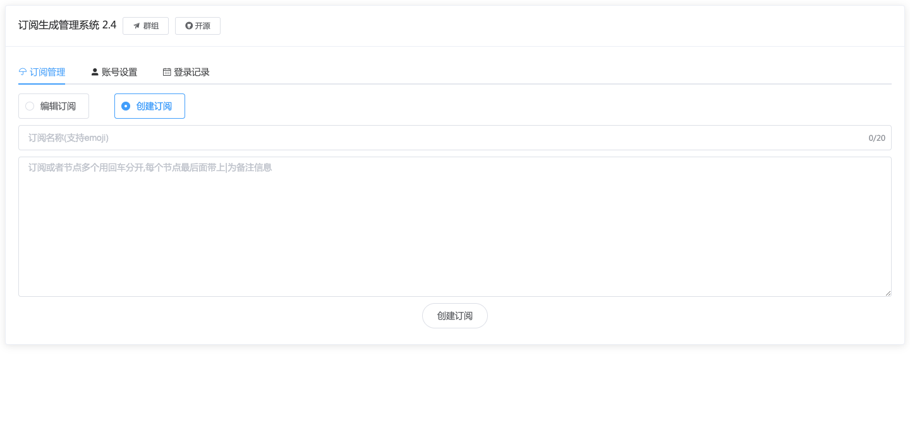
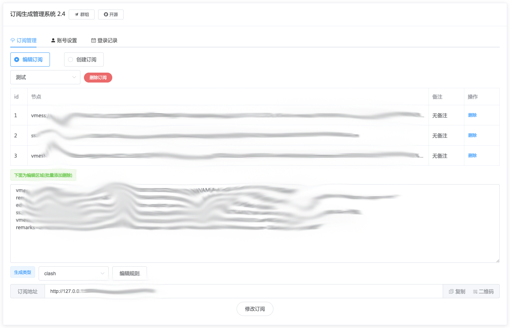

# 更新说明：
修复ss协议密码带@无法识别

修复新增节点bug

修复14天刷新令牌到期不注销问题

新增hy2 obfs参数 以及hysteria2和hy2两个开头都可以

# 功能说明：



节点转换成订阅，并且能够一直存储

方便多订阅管理，个人搭建使用

解决安全问题预防被偷节点,集成前后端

目前支持v2ray|clash|surge

v2ray格式通用的软件已测有下:v2rayn 小火箭等，还有一些没用过不知名

默认账户密码都是admin，请记得修改否则被扫端口容易泄漏

本人是自学前后端没多久的小白，希望口下留情

# 安装说明：

## 拉取或者更新docker镜像[容器支持amd和arm]

如果你有旧版本拉取前可以先停止和删除容器再删除镜像

docker rm -f sublink

docker images

docker rmi 这里填写IMAGEID

然后拉取镜像输入，默认拉取就是最新版本

```docker pull jaaksi/sublink```

## 持久化启动docker[挂载到本机docker数据卷]

sublink_data >> 数据卷名称

5000 >> 容器端口 << PORT

8000 >> 本机端口如公网访问的端口

如果不懂直接无脑粘贴启动即可
```
docker volume create sublink_data
docker run --name sublink -p 8000:5000 \
-v sublink_data:/app/app/db \
-e PORT=5000 \
-d jaaksi/sublink
```

查看数据存放目录```docker volume inspect sublink_data```

如果要自定义端口 -p 5000:5000左边的5000改成自定义右边为固定如:8000:5000

那么ip加8000端口即可访问

### 持久化启动docker方式二[挂载到指定目录]

/www/sublink_data >> 本机目录

5000 >> 容器端口 << PORT

8000 >> 本机端口如公网访问的端口

如果不懂直接无脑粘贴启动即可

```
docker run --name sublink -p 8000:5000 \
-v /www/sublink_data:/app/app/db \
-e PORT=5000 \
-d jaaksi/sublink 
```
# 假如你忘记了账号或者密码

初始化为admin，确保你的容器在运行的时候终端执行以下命令：

    docker exec -it sublink bash -c "python init_user_pw.py; exit"

本人电报联系：@toutie_1

电报群组:https://t.me/+u6gLWF0yP5NiZWQ1

USDT打赏：


